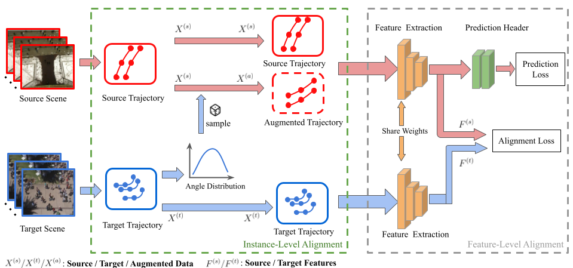
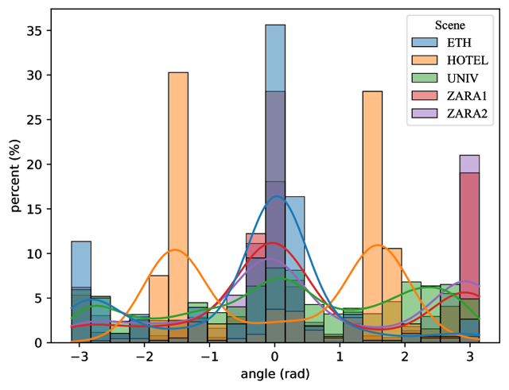
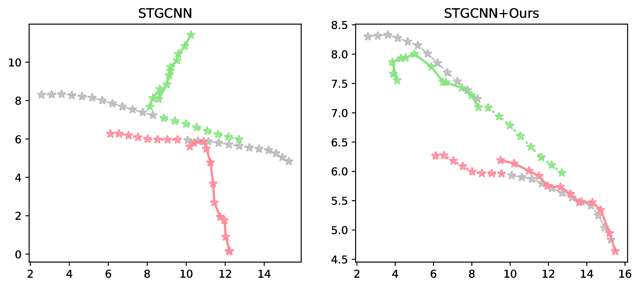
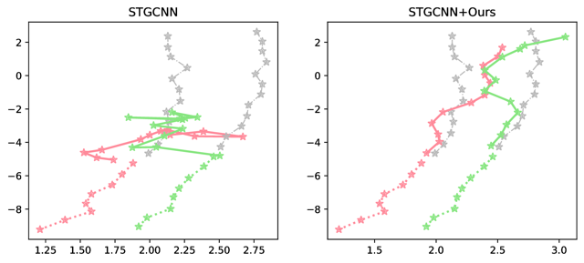
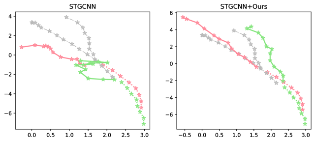

# PTP-DA
Official PyTorch code for the paper "Adaptive Pedestrian Trajectory Prediction via Target-Directed Data Augmentation". 

>Abstract: Pedestrian trajectory prediction is an important task for many applications such as autonomous driving and surveillance systems. Yet the prediction performance drops dramatically when applying a model trained on the source domain to a new target domain. Therefore, it is of great importance to adapt a predictor to a new domain. Previous works mainly focus on feature-level alignment to solve this problem. In contrast, we solve it from a new perspective of instance-level alignment. Specifically, we first point out one key factor of the domain gaps, i.e., trajectory angles, and then augment the source training data by target-directed orientation augmentation so that its distribution matches with that of the target data. In this way, the trajectory predictor trained on the aligned source data performs better on the target domain. Experiments on standard baselines show that our method improves the state of the art by a large margin.

# Installation

## Environment

- OS: Linux / RTX 2080Ti
- Python == 3.7.9
- PyTorch == 1.7.1+cu110

## Dependencies

Install the dependencies from the requirements.txt:

```bash
pip install -r requirements.txt
```

## Train

```bash
sh scripts/train.sh
```

# Metrics

We use the ADE and FDE as the metrics. Here we give the whole results of 20 experiment groups.

## ADE

|Method|A2B|A2C|A2D|A2E|B2A|B2C|B2D|B2E|C2A|C2B|C2D|C2E|D2A|D2B|D2C|D2E|E2A|E2D|E2C|E2A|AVG|
| ----| ----| ----| ----|----| ----| ----| ----|----| ----| ----| ----|----| ----| ----| ----|----| ----| ----| ----|----| ----|
|STGCNN|1.12|0.91|0.99|1.16|2.18|1.18|2.14|1.47|0.96|0.59|0.54|0.41|0.89|1.04|0.57|0.45|0.93|1.01|0.58|0.44|0.98|
|STGCNN+Ours|**0.80**|**0.87**|**0.98**|**0.90**|**1.24**|**0.55**|**0.65**|**0.61**|**0.69**|**0.27**|**0.36**|**0.31**|**0.83**|**0.32**|**0.46**|**0.43**|**0.70**|**0.23**|**0.42**|**0.40**|**0.60**|
|T-GNN|1.19|0.77|1.04|0.85|1.52|0.84|1.53|1.10|0.91|0.65|0.55|0.40|0.85|1.11|0.72|0.43|0.81|1.09|0.62|0.51|0.87|
|T-GNN+Ours|**0.70**|**0.75**|**0.90**|**0.84**|**0.91**|**0.52**|**0.68**|**0.45**|**0.75**|**0.28**|**0.47**|**0.36**|**0.81**|**0.29**|**0.45**|**0.38**|**0.68**|**0.23**|**0.43**|**0.41**|**0.58**|


## FDE

|Method|A2B|A2C|A2D|A2E|B2A|B2C|B2D|B2E|C2A|C2B|C2D|C2E|D2A|D2B|D2C|D2E|E2A|E2D|E2C|E2A|AVG|
| ----| ----| ----| ----|----| ----| ----| ----|----| ----| ----| ----|----| ----| ----| ----|----| ----| ----| ----|----| ----|
|STGCNN|1.49|**1.07**|1.34|1.49|3.21|1.97|4.18|2.62|1.20|0.88|0.98|0.65|0.96|1.62|0.83|**0.57**|1.37|1.58|0.87|0.67|1.48|
|STGCNN+Ours|**0.91**|1.10|**1.24**|**1.19**|**1.79**|**0.97**|**0.89**|**0.61**|**1.10**|**0.36**|**0.65**|**0.51**|**0.95**|**0.43**|**0.77**|0.69|**1.15**|**0.31**|**0.74**|**0.66**|**0.85**|
|T-GNN|1.74|1.01|1.45|**1.04**|2.19|1.28|2.68|1.84|1.34|1.11|0.99|0.69|1.25|1.74|0.97|**0.53**|1.18|1.70|0.88|0.79|1.31|
|T-GNN+Ours|**0.91**|**0.96**|**1.29**|1.10|**1.27**|**0.94**|**1.26**|**0.76**|**1.16**|**0.40**|**0.79**|**0.61**|**1.16**|**0.37**|**0.74**|0.61|**1.06**|**0.42**|**0.74**|**0.70**|**0.89**|


## Comparative Experiments

We compare our method to naive augmentations which not leverage any target information. Here are ADE/FDE results of 5 selected groups:

|Method|A2B|B2C|C2D|D2E|E2A|AVG|
| ----| ----| ----| ----|----| ----| ----|
|STGCNN|1.12/1.49|1.18/1.97|0.54/0.98|0.45/0.57|0.93/1.37|0.84/1.28|
|+ Random|0.92/1.10|0.55/0.97|0.37/0.67|0.43/0.67|1.79/2.26|0.81/1.13|
|+ Ours|0.80/0.91|0.55/0.97|0.36/0.65|0.43/0.69|0.70/1.15|0.57/0.87|


# Visualizations

## Method workflow



## Statistics



## Cases analysis





The source domain and the target domain have completely opposite road structures. Without our method, the model would still predict based on the direction of the source domain. Meanwhile, our method successful transfer of knowledge to the target domain.


Case3 shows group walking pattern.



Case4 shows conflict walking pattern.

